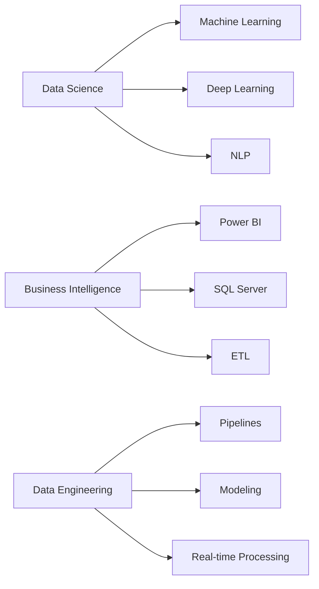

<div align="center">
  
</div>

<h1 align="center">
  
</h1>

<h3 align="center">🎯 Data Science & Business Intelligence Engineer | Rabat, Morocco 🇲🇦</h3>

<p align="center">
  
  
  
</p>

---

## 🧠 About Me
```python
class DataScientist:
    def __init__(self):
        self.name = "Omar Laraje"
        self.role = "Data Science & BI Engineer"
        self.location = "Rabat, Morocco 🇲🇦"
        self.education = "ISMAGI - Engineering Student"
        self.languages = ["Python", "SQL", "French", "English", "Arabic"]
        self.passion = "Transforming data into actionable insights"
    
    def say_hi(self):
        print("Thanks for visiting! Let's turn data into impact together.")

me = DataScientist()
me.say_hi()
```

I'm a passionate **Data Science & Business Intelligence enthusiast** who loves transforming raw data into **meaningful insights and predictive solutions**. Currently pursuing my engineering degree in **BI & Data Science**, I focus on **data analysis, dashboard design, and machine learning** for smarter business decisions.

💡 ***"Data tells a story — I make it speak clearly."***

---

## 🚀 What I Do

<table>
<tr>
<td width="50%">

### 📊 Business Intelligence
- SQL Server, SSIS, SSAS
- Power BI & Interactive Dashboards
- ETL Pipeline Development
- KPI Design & Monitoring
- Real-Time Data Analytics

</td>
<td width="50%">

### 🧠 Data Science & AI
- Machine Learning (Scikit-learn, TensorFlow)
- Predictive Analytics
- Natural Language Processing
- Computer Vision
- Deep Learning Models

</td>
</tr>
</table>

---

## 🛠️ Tech Stack

<p align="center">
  
  
  
  
  
  
  
  
  
  
  
  
</p>

### 📊 Technical Proficiency

<table>
<tr>
<td align="center" width="25%">

<br><strong>Python</strong>
</td>
<td align="center" width="25%">

<br><strong>SQL</strong>
</td>
<td align="center" width="25%">

<br><strong>Power BI</strong>
</td>
<td align="center" width="25%">

<br><strong>TensorFlow</strong>
</td>
</tr>
<tr>
<td align="center" width="25%">

<br><strong>Pandas</strong>
</td>
<td align="center" width="25%">

<br><strong>NumPy</strong>
</td>
<td align="center" width="25%">

<br><strong>Scikit-learn</strong>
</td>
<td align="center" width="25%">

<br><strong>MySQL</strong>
</td>
</tr>
</table>

---

## 🧩 Featured Projects

<details open>
<summary><b>⚡ Power BI Real-Time Dashboard</b></summary>
<br>


**Performance monitoring system for power plants**
- Real-time data integration using SSIS
- Interactive Power BI dashboards with KPIs
- Predictive maintenance analytics
- SQL Server database optimization
- Python-based data processing pipelines

[🔗 View Project](#) | [📊 Live Demo](#)

</details>

<details>
<summary><b>🧠 AI Absence Tracker</b></summary>
<br>


**CNN-based facial recognition attendance system**
- Deep learning model for face detection
- Real-time attendance tracking
- 95%+ accuracy rate
- Automated reporting system
- Integration with existing databases

[🔗 View Project](#) | [📖 Documentation](#)

</details>

<details>
<summary><b>📰 Fake News Detection</b></summary>
<br>


**Machine learning model for news authenticity verification**
- TF-IDF vectorization
- Logistic Regression & Naive Bayes models
- 92% classification accuracy
- Interactive Streamlit web app
- Real-time prediction interface

[🔗 View Project](https://github.com/omarlr-pro/fake-news-detector) | [🚀 Try it](#)

</details>

<details>
<summary><b>🤖 ISMAGI Assistant</b></summary>
<br>


**Intelligent virtual assistant for student support**
- Natural Language Understanding
- Intent recognition system
- Knowledge base integration
- Multi-turn conversation handling
- Streamlit-based UI

[🔗 View Project](#) | [💬 Chat Demo](#)

</details>

---

## 🏆 Achievements & Experience

<table>
<tr>
<td width="50%">

### 🎓 Education
**ISMAGI - Engineering School**
- Major: Business Intelligence & Data Science
- Focus: Machine Learning, Big Data, Analytics
- Expected Graduation: 2025

</td>
<td width="50%">

### 💼 Professional Experience
**MASEN - Internship**
- Developed real-time BI dashboards
- Built predictive maintenance models
- Optimized ETL pipelines
- Collaborated with data teams

</td>
</tr>
</table>

### 🌟 Key Competencies


---

## 📊 GitHub Statistics

<p align="center">
  
  
</p>

<p align="center">
  
  
</p>

### 📈 Contribution Activity

<p align="center">
  
</p>

---

## 🌐 Connect With Me

<p align="center">
  <a href="https://www.linkedin.com/in/omar-laraje-998827233/" target="_blank">
    
  </a>
  <a href="https://github.com/omarlr-pro" target="_blank">
    
  </a>
  <a href="https://www.instagram.com/omar_lr___/" target="_blank">
    
  </a>
  <a href="https://x.com/Omargaimor" target="_blank">
    
  </a>
  <a href="mailto:your.email@example.com">
    
  </a>
</p>

---

## 💼 Open to Opportunities

I'm actively seeking opportunities in:
- 🎯 Data Science & Analytics roles
- 📊 Business Intelligence positions
- 🤖 Machine Learning projects
- 🔬 Research collaborations
- 💡 Consulting & Freelance work

**Let's collaborate and create data-driven solutions together!**

---

## 📝 Latest Blog Posts

<!-- BLOG-POST-LIST:START -->
- [Understanding Machine Learning Pipelines](#)
- [Power BI Best Practices for Real-Time Dashboards](#)
- [Building Scalable ETL Processes with Python](#)
- [Deep Dive into Natural Language Processing](#)
<!-- BLOG-POST-LIST:END -->

---

## 🎯 Current Focus
```javascript
const currentFocus = {
  learning: ["Advanced ML Algorithms", "Cloud Computing (AWS/Azure)", "MLOps"],
  building: ["End-to-end ML pipelines", "Real-time analytics platforms"],
  exploring: ["Generative AI", "Large Language Models", "AutoML"],
  contributing: ["Open-source ML projects", "Data science communities"]
};
```

---

<div align="center">
  
### 💭 Quote of the Day
  


</div>

---

<p align="center">
  
</p>

<h3 align="center">
  ✨ <i>"Turning data into knowledge, and knowledge into impact."</i> ✨
</h3>

<p align="center">
  
</p>
