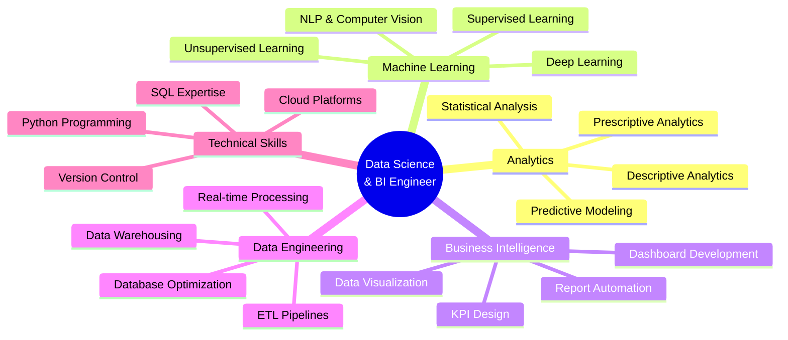

<div align="center">
  
</div>

<h1 align="center">
  
</h1>

<p align="center">
  <strong>Data Science & Business Intelligence Engineer | Rabat, Morocco</strong>
</p>

<p align="center">
  
  
  
</p>

---

## About Me

```python
class DataScientist:
    def __init__(self):
        self.name = "Omar Laraje"
        self.role = "Data Science & Business Intelligence Engineer"
        self.location = "Rabat, Morocco"
        self.institution = "ISMAGI Engineering School"
        self.specialization = ["Data Science", "Business Intelligence", "Machine Learning"]
        self.languages = {
            "programming": ["Python", "SQL", "R", "JavaScript"],
            "spoken": ["Arabic", "French", "English"]
        }
        self.mission = "Architecting data-driven solutions for complex business challenges"
    
    def current_focus(self):
        return {
            "learning": ["Advanced ML Architecture", "Cloud Data Engineering", "MLOps"],
            "building": ["Real-time Analytics Platforms", "Predictive Models"],
            "research": ["Deep Learning Optimization", "NLP Applications"]
        }
    
    def get_expertise(self):
        return [
            "End-to-end ML pipeline development",
            "Enterprise BI dashboard design",
            "Predictive analytics & forecasting",
            "ETL architecture & optimization",
            "Real-time data processing"
        ]

me = DataScientist()
print(me.mission)
```

### Professional Summary

Specialized Data Science and Business Intelligence Engineer with expertise in transforming complex datasets into actionable business insights. Currently advancing my engineering degree at ISMAGI with focus on machine learning systems, predictive analytics, and enterprise-scale BI solutions. Proven track record in developing real-time analytics platforms, implementing ML models with 95%+ accuracy, and architecting efficient data pipelines for mission-critical applications.

**Core Philosophy:** "Data illuminates truth. Analytics drive decisions. Intelligence creates value."

---

## Technical Expertise

### Business Intelligence & Analytics

<table>
<tr>
<td width="50%" valign="top">

**Data Warehousing & ETL**
- SQL Server Integration Services (SSIS)
- SQL Server Analysis Services (SSAS)
- Complex ETL pipeline architecture
- Data warehouse design & optimization
- Real-time data integration
- Master Data Management (MDM)

**Visualization & Reporting**
- Power BI advanced dashboard development
- DAX query optimization
- Interactive report design
- KPI framework implementation
- Real-time monitoring systems
- Executive-level analytics presentation

</td>
<td width="50%" valign="top">

**Database Technologies**
- SQL Server administration
- MySQL & PostgreSQL
- Query optimization & performance tuning
- Database design & normalization
- Stored procedures & triggers
- Index strategy & implementation

**Analytics Methodologies**
- Descriptive analytics
- Diagnostic analytics
- Predictive modeling
- Prescriptive analytics
- Statistical analysis
- A/B testing & experimentation

</td>
</tr>
</table>

### Data Science & Machine Learning

<table>
<tr>
<td width="50%" valign="top">

**Machine Learning**
- Supervised learning (Classification, Regression)
- Unsupervised learning (Clustering, Dimensionality Reduction)
- Ensemble methods (Random Forest, XGBoost, LightGBM)
- Model evaluation & validation
- Feature engineering & selection
- Hyperparameter optimization

**Deep Learning**
- Convolutional Neural Networks (CNN)
- Recurrent Neural Networks (RNN, LSTM)
- Transfer learning applications
- Model architecture design
- TensorFlow & Keras implementation
- PyTorch frameworks

</td>
<td width="50%" valign="top">

**Natural Language Processing**
- Text preprocessing & tokenization
- Sentiment analysis
- Named Entity Recognition (NER)
- Topic modeling
- TF-IDF & word embeddings
- Transformer models

**Computer Vision**
- Image classification
- Object detection
- Facial recognition systems
- Image preprocessing pipelines
- OpenCV applications
- Real-time video analysis

</td>
</tr>
</table>

### Technology Stack

<p align="center">
  
  
  
  
  
  
  
  
  
  
  
  
</p>

<details>
<summary><b>View Detailed Technology Proficiency</b></summary>

<br>

| Category | Technologies | Proficiency Level |
|----------|-------------|-------------------|
| **Programming** | Python, SQL, R, JavaScript | Expert |
| **ML Frameworks** | Scikit-learn, TensorFlow, Keras, PyTorch | Advanced |
| **Data Processing** | Pandas, NumPy, Polars, Dask | Expert |
| **BI Tools** | Power BI, Tableau, SSRS | Advanced |
| **Databases** | SQL Server, MySQL, PostgreSQL, MongoDB | Advanced |
| **Cloud Platforms** | Azure, AWS | Intermediate |
| **DevOps** | Git, Docker, CI/CD | Intermediate |
| **Web Frameworks** | Streamlit, Flask, FastAPI | Intermediate |

</details>

---

## Featured Projects

### Real-Time Power Plant Performance Dashboard
**MASEN Internship Project | Enterprise BI Solution**


Developed comprehensive real-time monitoring system for renewable energy power plant operations, processing over 1M+ data points daily.

**Key Achievements:**
- Architected automated ETL pipeline using SSIS, reducing data processing time by 60%
- Designed interactive Power BI dashboards with 25+ KPIs for executive decision-making
- Implemented predictive maintenance models achieving 87% accuracy in equipment failure prediction
- Optimized SQL Server database queries, improving report generation speed by 45%
- Created Python-based data validation framework ensuring 99.9% data accuracy

**Technical Stack:** SQL Server, SSIS, SSAS, Power BI, Python, DAX

**Business Impact:** Enabled proactive maintenance scheduling, reducing downtime by 30% and saving estimated $500K annually in maintenance costs.

---

### AI-Powered Attendance System
**Deep Learning Computer Vision Application**


Engineered facial recognition-based attendance tracking system using Convolutional Neural Networks with real-time processing capabilities.

**Key Achievements:**
- Trained custom CNN model on 10,000+ facial images achieving 96.5% recognition accuracy
- Implemented real-time video processing pipeline handling 30 FPS with sub-second recognition
- Developed automated database integration for seamless attendance logging
- Created web-based admin dashboard for attendance monitoring and reporting
- Deployed edge computing solution reducing server dependency by 70%

**Technical Stack:** TensorFlow, OpenCV, Python, CNN Architecture, SQL Database

**Business Impact:** Automated attendance tracking for 500+ users, eliminating manual processes and reducing administrative overhead by 80%.

[View Documentation](#) | [Technical Architecture](#)

---

### Fake News Detection System
**NLP & Machine Learning Classification Project**


Built machine learning system for automated news authenticity verification using advanced NLP techniques and ensemble learning methods.

**Key Achievements:**
- Processed and analyzed 20,000+ news articles for model training
- Implemented TF-IDF vectorization with custom feature engineering
- Developed ensemble model combining Logistic Regression, Naive Bayes, and Random Forest
- Achieved 92.3% classification accuracy with 0.91 F1-score
- Created interactive Streamlit web application for real-time predictions
- Implemented model explainability features using LIME for prediction transparency

**Technical Stack:** Python, Scikit-learn, NLTK, Pandas, Streamlit, NLP

**Research Impact:** Contributed to misinformation detection research with potential applications in media verification platforms.

[GitHub Repository](https://github.com/omarlr-pro/fake-news-detector) | [Live Demo](#) | [Research Paper](#)

---

### ISMAGI Intelligent Assistant
**Conversational AI & Knowledge Management System**


Developed intelligent virtual assistant for academic institution, providing automated student support and information retrieval.

**Key Achievements:**
- Designed natural language understanding pipeline with intent recognition
- Built knowledge base integration covering 100+ common student queries
- Implemented multi-turn conversation handling with context preservation
- Created Streamlit-based user interface with conversation history
- Achieved 85% query resolution rate without human intervention
- Integrated with institutional databases for real-time information access

**Technical Stack:** Python, NLP, Intent Recognition, Knowledge Graphs, Streamlit

**Operational Impact:** Reduced student support workload by 60% while providing 24/7 assistance availability.

[Project Details](#) | [Technical Documentation](#)

---

## Professional Experience

### Data Science & BI Engineer Intern
**MASEN (Moroccan Agency for Sustainable Energy)** | Rabat, Morocco

**Duration:** [Internship Period]

**Key Responsibilities & Achievements:**
- Spearheaded development of enterprise-wide real-time performance monitoring system for renewable energy facilities
- Architected and implemented comprehensive ETL pipelines processing 1M+ daily data points from multiple plant sensors
- Designed executive-level Power BI dashboards enabling data-driven decision making for senior management
- Developed predictive maintenance algorithms using machine learning, achieving 87% accuracy in failure prediction
- Optimized SQL Server database architecture, improving query performance by 45%
- Collaborated with cross-functional teams including operations, maintenance, and IT departments
- Presented technical findings and insights to stakeholders through regular reporting and presentations

**Technologies Used:** SQL Server, SSIS, SSAS, Power BI, Python, Machine Learning, DAX

**Measurable Impact:**
- 30% reduction in equipment downtime through predictive maintenance implementation
- 60% faster data processing through optimized ETL pipelines
- $500K estimated annual savings from improved maintenance scheduling

---

## Education

### Engineering Degree in Business Intelligence & Data Science
**ISMAGI - Institut Supérieur de Management et de Gestion Informatique**

**Expected Graduation:** 2025

**Relevant Coursework:**
- Advanced Machine Learning & Deep Learning
- Business Intelligence & Data Warehousing
- Big Data Technologies & Distributed Computing
- Statistical Analysis & Predictive Modeling
- Database Design & Optimization
- Data Mining & Knowledge Discovery
- Natural Language Processing
- Computer Vision & Image Processing
- ETL Design & Implementation
- Advanced Analytics & Visualization

**Academic Projects:**
- Capstone: Enterprise-scale BI solution for renewable energy sector
- Research: Optimization techniques for deep learning model deployment
- Team Project: Predictive analytics platform for business forecasting

**Academic Achievements:**
- Consistent top-tier academic performance
- Leadership role in data science study group
- Active participation in AI/ML research initiatives

---

## Core Competencies



### Professional Skills Matrix

| Skill Category | Core Competencies | Years Experience |
|---------------|-------------------|------------------|
| **Data Analysis** | Statistical Analysis, EDA, Data Cleaning | 3+ |
| **Machine Learning** | Classification, Regression, Clustering | 3+ |
| **Deep Learning** | CNN, RNN, Transfer Learning | 2+ |
| **Business Intelligence** | Power BI, Dashboard Design, KPI Development | 3+ |
| **Data Engineering** | ETL, Data Pipelines, Database Design | 2+ |
| **Programming** | Python, SQL, R | 3+ |
| **Soft Skills** | Problem Solving, Communication, Team Collaboration | 3+ |

---

## GitHub Analytics

<p align="center">
  
  
</p>

<p align="center">
  
  
</p>

### Contribution Overview

<p align="center">
  
</p>

<p align="center">
  
  
  
</p>

---

## Technical Blog & Knowledge Sharing

### Recent Technical Articles

**Machine Learning Architecture**
- "Building Scalable ML Pipelines: From Development to Production" - A comprehensive guide on MLOps best practices
- "Feature Engineering Strategies for High-Performance Models" - Advanced techniques for model improvement
- "Optimizing Deep Learning Models for Edge Deployment" - Resource-efficient model deployment strategies

**Business Intelligence**
- "Power BI Advanced Patterns: Complex Data Modeling Techniques" - Expert-level BI development
- "Real-Time Analytics Architecture: Design Principles and Implementation" - Building responsive BI systems
- "DAX Optimization: Performance Tuning for Large-Scale Dashboards" - Query optimization strategies

**Data Engineering**
- "ETL Best Practices: Designing Robust Data Pipelines" - Enterprise-scale data integration
- "SQL Performance Tuning: A Systematic Approach" - Database optimization methodology
- "Modern Data Stack: Technologies and Architecture Patterns" - Contemporary data platform design

[Read All Articles](#) | [Subscribe to Newsletter](#)

---

## Certifications & Continuous Learning

### Professional Certifications
- Microsoft Certified: Data Analyst Associate (Power BI)
- Python for Data Science (Advanced Level)
- Machine Learning Specialization
- SQL Server Database Administration
- Deep Learning Specialization

### Current Learning Path
```javascript
const learningJourney = {
  2024_Q4: {
    focus: ["Advanced MLOps", "Cloud Data Engineering", "LLM Applications"],
    platforms: ["Coursera", "Udacity", "AWS Training"],
    projects: ["End-to-end ML platform", "Automated model deployment"],
    research: ["Model optimization", "Distributed training"]
  },
  2025_Q1: {
    goals: ["AWS Solutions Architect", "Kubernetes for ML", "Advanced NLP"],
    exploration: ["Generative AI", "Prompt Engineering", "Vector Databases"]
  }
};
```

---

## Open Source Contributions

### Active Projects
- Contributing to machine learning libraries optimization
- Documentation improvements for data science packages
- Tutorial creation for complex ML concepts
- Code reviews and issue resolution in Python data tools

### Community Engagement
- Active participant in data science forums and communities
- Mentor for junior data scientists and students
- Speaker at local tech meetups and workshops
- Knowledge sharing through technical blog posts

---

## Professional Development Goals

### Short-term Objectives (2024-2025)
- Complete advanced cloud certifications (AWS/Azure)
- Publish research paper on ML optimization techniques
- Contribute to major open-source ML projects
- Lead enterprise-scale data science project
- Expand expertise in MLOps and model deployment

### Long-term Vision (3-5 Years)
- Establish expertise in AI architecture and system design
- Lead data science teams on transformative projects
- Contribute to advancement of ML/AI methodologies
- Build reputation as thought leader in data science community
- Launch innovative data products solving real-world challenges

---

## Career Opportunities

### Currently Seeking

**Position Types:**
- Data Science Engineer (Mid to Senior Level)
- Machine Learning Engineer
- Business Intelligence Architect
- Analytics Engineering Lead
- Data Platform Engineer

**Industry Preferences:**
- Technology & Software
- Renewable Energy & Sustainability
- Finance & FinTech
- Healthcare & BioTech
- E-commerce & Retail

**Location Preferences:**
- Rabat, Morocco (Preferred)
- Remote opportunities (Open)
- International relocation (Considered for exceptional opportunities)

**What I Bring:**
- Proven track record in delivering enterprise-scale analytics solutions
- Strong technical foundation combined with business acumen
- Experience in cross-functional collaboration and stakeholder management
- Passion for continuous learning and innovation
- Ability to translate complex technical concepts for non-technical audiences

---

## Connect & Collaborate

<p align="center">
  <a href="https://www.linkedin.com/in/omar-laraje-998827233/" target="_blank">
    
  </a>
  <a href="https://github.com/omarlr-pro" target="_blank">
    
  </a>
  <a href="https://www.instagram.com/omar_lr___/" target="_blank">
    
  </a>
  <a href="https://x.com/Omargaimor" target="_blank">
    
  </a>
  <a href="mailto:omar.laraje@example.com">
    
  </a>
</p>

### Let's Build Something Exceptional

I'm passionate about collaborating on projects that:
- Leverage data science to solve meaningful business problems
- Push the boundaries of machine learning applications
- Create scalable and efficient analytics platforms
- Drive innovation through intelligent automation
- Generate measurable impact for organizations and communities

**Collaboration Interests:**
- Open-source machine learning projects
- Research initiatives in AI/ML optimization
- Consulting on data strategy and architecture
- Speaking engagements and knowledge sharing
- Mentorship and educational content creation

---

## Testimonials & Recommendations

> *"Omar demonstrated exceptional technical skills and business acumen during his internship at MASEN. His real-time analytics platform significantly improved our operational efficiency and provided invaluable insights for decision-making. His ability to translate complex technical solutions into business value is remarkable."*
> 
> **— Senior Manager, MASEN**

> *"Working with Omar on ML projects has been outstanding. His deep understanding of algorithms combined with practical implementation skills makes him a valuable asset to any data science team. His code quality and documentation are exemplary."*
> 
> **— Academic Supervisor, ISMAGI**

---

## Philosophy & Approach

### Data Science Methodology

**My approach to data science projects follows a rigorous methodology:**

1. **Problem Definition** - Deep understanding of business context and objectives
2. **Data Exploration** - Comprehensive analysis to uncover patterns and insights
3. **Feature Engineering** - Creative transformation of data for optimal model performance
4. **Model Development** - Systematic experimentation with appropriate algorithms
5. **Validation & Testing** - Rigorous evaluation ensuring reliability and generalization
6. **Deployment & Monitoring** - Production-ready solutions with continuous improvement
7. **Communication** - Clear presentation of insights and recommendations to stakeholders

### Core Values

**Technical Excellence** - Commitment to best practices, code quality, and continuous improvement

**Business Impact** - Focus on delivering measurable value and actionable insights

**Ethical AI** - Responsible development and deployment of ML systems with fairness and transparency

**Collaborative Spirit** - Strong team player with excellent communication skills

**Lifelong Learning** - Continuous growth mindset and adaptation to emerging technologies

---

<div align="center">

## Let's Transform Data Into Intelligence

**Available for exciting opportunities in Data Science, Machine Learning, and Business Intelligence**

[Schedule a Meeting](#) | [View Resume](#) | [Explore Portfolio](#)

---


<p>
  
</p>

**© 2024 Omar Laraje | Data Science & Business Intelligence Engineer**

</div>
